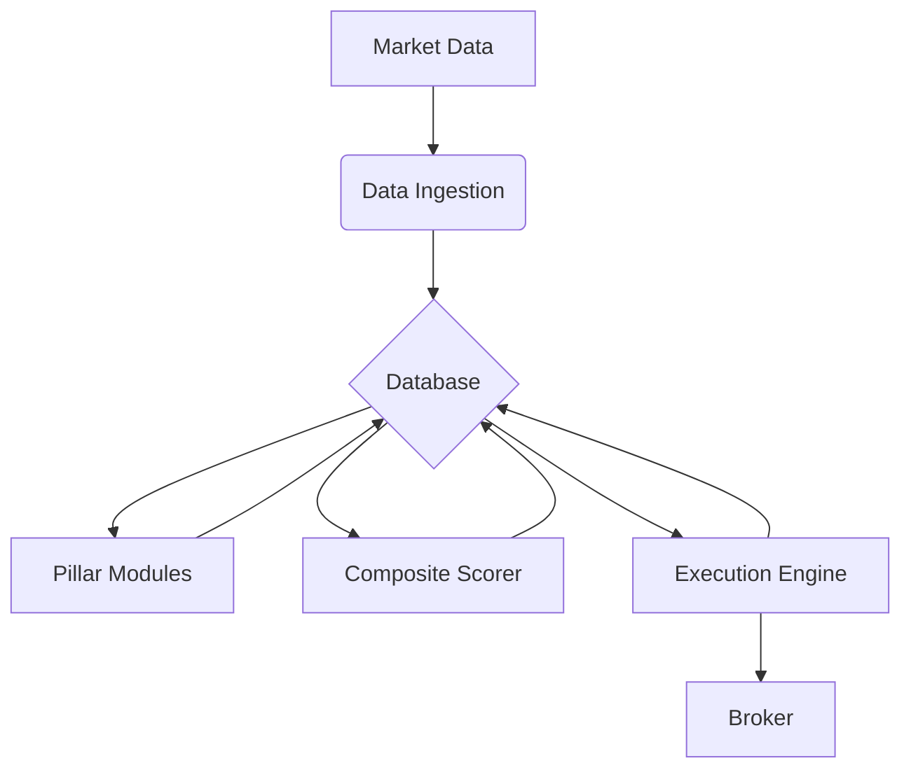

# AlphaPivot System Architecture

This document provides a detailed overview of the AlphaPivot trading system's architecture. It is intended for developers who want to understand the inner workings of the system and contribute to its development.

## High-Level Architecture

The system is designed as a modular, data-driven pipeline that processes market data, generates trading signals, and executes trades. The architecture is centered around a PostgreSQL/TimescaleDB database, which serves as the central hub for all data and communication between the different components.

```
[ Market Data ] -> [ Data Ingestion ] -> [ Database ] -> [ Pillar Modules ] -> [ Composite Scorer ] -> [ Execution Engine ] -> [ Broker ]
```

### Core Principles

- **Modularity**: Each component of the system is designed to be independent and have a single, well-defined responsibility. This makes the system easier to test, maintain, and extend.
- **Data-Driven**: The system is driven by the data that is stored in the database. Components do not communicate with each other directly but rather through the database. This decouples the components and allows them to be developed and deployed independently.
- **Configuration-Based**: The behavior of the system is controlled by a single, unified `config.ini` file. This makes it easy to change the system's parameters without having to modify the code.

## Data Flow Diagram



### Component Descriptions

1.  **Data Ingestion**: This component is responsible for fetching market data (futures and spot) from the data provider and storing it in the database. It is designed to be run on a schedule to keep the database up-to-date with the latest market data.

2.  **Pillar Modules (`/pillars`)**: The pillars are the core of the signal generation process. Each pillar is a separate Python module that implements a specific trading strategy or market analysis technique. The pillars read market data from the database, perform their analysis, and write their signals back to the database.

3.  **Composite Scorer (`composite_worker_v2.py`)**: This module reads the signals from the individual pillars and combines them into a single, composite score. This score represents the overall trading bias of the system and is used by the execution engine to make trading decisions. The weights of the different pillars can be configured in the `config.ini` file.

4.  **Execution Engine (`executor.py`)**: The execution engine is the final stage of the pipeline. It reads the composite scores from the database and, if they meet the configured criteria, executes trades in the market through the broker's API. The execution engine is also responsible for managing the lifecycle of trades, including placing stop-loss and take-profit orders.

5.  **Database**: The database is the central hub of the system. It stores all the market data, trading signals, and trade information. The use of a TimescaleDB extension allows for efficient storage and querying of time-series data.

## Directory Structure

-   **`/configs`**: Contains configuration files for the system. *(This is now consolidated into `config.ini`)*.
-   **`/pillars`**: Contains the pillar modules for signal generation.
-   **`/scheduler`**: Contains scripts for running the various components of the system on a schedule.
-   **`/utils`**: Contains shared utility modules.
-   **`config.ini`**: The main configuration file for the system.
-   **`executor.py`**: The main trade execution engine.
-   **`README.md`**: The main documentation file for the project.
-   **`ARCHITECTURE.md`**: This file.